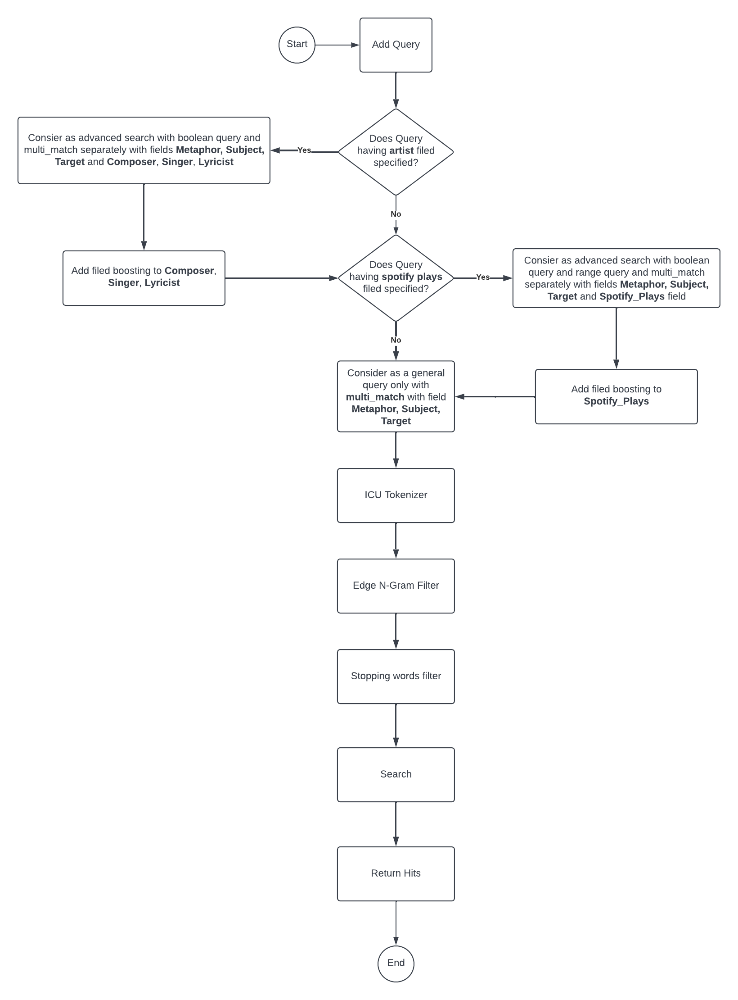

# Search Sinhala Songs with Metaphors

## CS4642 - Data Mining & Information Retrieval - Mini Project 2

# Introduction

This project is developed under Information Retrieval (second part of the module) and it is built according to the mono-repo architecture. There are following sections in this project.

- Database with [ElasticSearch](https://www.elastic.co/)
- Backend server with [Express.Js](https://expressjs.com/)
- Frontend with [Next.Js](https://nextjs.org/)

**Note :-** The crawling part was not done, the songs had to be searched manually because the metaphors cannot extracted using crawling technique. There are 101 songs up to 3 metaphors in each song in the corpus and the details of the songs are manually extracted using following websites.

- [https://www.lklyrics.com/](https://www.lklyrics.com/)
- [https://www.sinhalalyricspedia.com/](https://www.sinhalalyricspedia.com/)
- [https://open.spotify.com/](https://open.spotify.com)

# Functionalities

 1. **Basic search functionality for metaphor searching.** Using this functionality a user can search songs which have specific metaphors. After searching, user can see a list of songs. The input query specifically looks for each song's **Metaphor_Sinhala**, **Subject_Sinhala** and **Target_Sinhala** fields in the corpus.
       - Ex: ගලන ගඟක රළ වාගේ, ගලන ගඟක රළ, ගලන ගඟ

 2. **Advanced search option with additional two fields.** With this advanced search option user can specify the **Artists (Composers/Singers/Lyricists)** and lower bound for the **Spotify plays**. Using this user can get more idea about there search like how popular the song is.
     - Ex: Metaphor: ගලන ගඟක, Artist: චරිත අත්තලගේ, Spotify plays: 1000000

 3. **Spell correction ability.** Like in the most of the search engines this has ability to search even though the query has some spelling mistakes.
    - Ex: චරිත අත්තලගේ, චරිත අතලගේ, චරි අතලගේ

 4. **See full details of a selected song in the list.** This is not a ElasticSearch feature but a feature of the frontend.

# Used Technologies

1. **Tokenization :-** 
   - Here the **ICU Tokenizer** used rather using standard tokenizer. According to the documentation of the ElasticSearch, this is lot lot like the standard tokenizer but it has better support for Unicode text segmentation specially for some Asian countries.
   - In addition to that queries are processed using **Edge n-gram tokenizer**. Here, according to the documentation, it breaks down the words of the tokenized query further and check each broken words with the indexed fields.

2. **Stopping Words :-**
    - The stopping words are specified according to the each fields of song, composer, singer, lyricist. When users search their query with these words query will be considered by ElasticSearch ignoring these stopping words. Usually this works with only English language. But here it has been modified with custom stopping word filter specially for given set fo Sinhala words.

3. **Range Query :-**
    - Here, range query will be used to advanced filter mentioned above. It considers the **Spotify_Plays** field which is an integer field. When user mentioning about specific number in Spotify Plays field, result will be given the songs with only having greater than equal values to the specified count.

4. **Field Boosting :-**
    - This feature is also used with advance search section. When user specifies the artist name, then the fields **Composer_Sinhala**, **Singer_Sinhala**, **Lyricist_Sinhala**, or spotify plays then the **Spotify_Play** field will get additional boosting count of 2.

# Architecture of Query Process in ElasticSearch

# Instructions for Application Running

1. Run ElasticSearch on port 9200.
2. Go into elasticsearch folder in terminal and run `npm run build` and then run `npm run index`.
3. Go into backend folder in terminal and run `npm run build` and then run `npm run start`. Keep the terminal running.
4. Go into frontend folder using another terminal session and run `npm run dev`. Navigate to the `http:\\localhost:3000`.
5. Search sinhala songs by metaphors in the give User Interface.